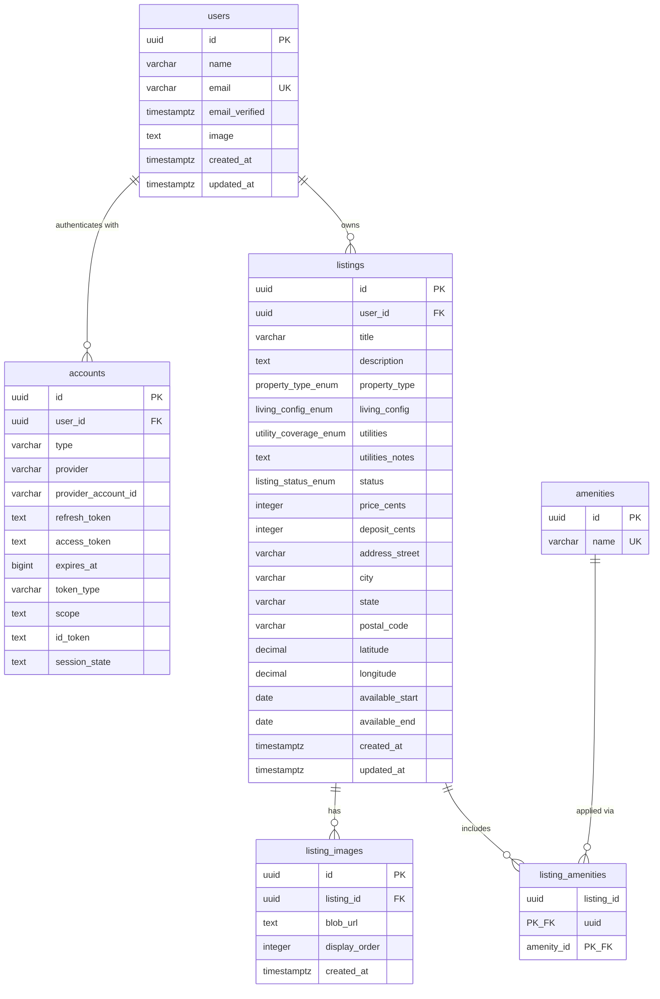

# Engineering Implementation Plan

Build the prototype described in `prd.md`: a Next.js sublet marketplace a reviewer can browse without an account, then list a place after Google sign-in. Ship the demo path only.

## Locked choices

| Decision | Choice |
| --- | --- |
| App | Next.js App Router, React Server Components, Server Actions |
| Host | Vercel Hobby |
| Auth | Auth.js v5, Google provider, JWT in an HTTP-only cookie |
| Database | Neon Postgres, pooled connection string |
| ORM | Drizzle |
| Images | Vercel Blob client upload |
| Maps | Mapbox via `react-map-gl`; server-side Geocoding API |
| UI | DaisyUI |
| Money | Integer cents in the database, dollars in the UI |

The prototype writes `listings.status = 'active'` only. Edit, delete, draft, rented, archived, in-app chat, payments, and phone capture stay out.

## Build order

Each step is done when its exit check passes. Do not start image upload or the map until search and detail render seeded rows.

1. **Scaffold.** `create-next-app` with TypeScript, Tailwind, and the App Router. Add DaisyUI as the component layer, plus Drizzle, Auth.js, Zod, `@vercel/blob`, and `react-map-gl`.
2. **Schema.** Apply the SQL in `prd.md` through a Drizzle migration on Neon. Seed the seven amenities.
3. **Seed listings.** Insert one host user and eight `active` listings, with images and amenity links, so `/search` is populated before anyone signs in.
4. **Read path.** Header, landing page, `/search`, and `/listings/[id]` read from Neon. No auth on these routes.
5. **Auth gate.** Google sign-in runs only when an anonymous user opens `/create-listing`, then returns them to that form.
6. **Create path.** Validated Server Action inserts the listing, geocodes the address, uploads images, and links amenities.
7. **Deploy.** Vercel project, production env vars, Google redirect URI for the deployed origin.

## App layout

```text
app/
  layout.tsx                      header on every page
  page.tsx                        landing: Search Sublets, List a Sublet
  search/page.tsx                 filters from the query string, card grid
  listings/[id]/page.tsx          detail
  create-listing/page.tsx         auth gate, then the form
  api/auth/[...nextauth]/route.ts
  api/blob/upload/route.ts        token route for client uploads
auth.ts                           Auth.js config
drizzle/schema.ts
drizzle/seed.ts
lib/db.ts
lib/validators.ts                 Zod schema shared by the form and the action
components/
  header.tsx
  filter-bar.tsx
  listing-card.tsx
  listing-form.tsx                client component
  neighborhood-map.tsx            client component, detail page only
```

## Environment

```text
DATABASE_URL                      Neon pooled connection string
AUTH_SECRET
AUTH_GOOGLE_ID
AUTH_GOOGLE_SECRET
AUTH_URL                          http://localhost:3000 locally, the Vercel URL in production
BLOB_READ_WRITE_TOKEN
NEXT_PUBLIC_MAPBOX_TOKEN          public token, map tiles only
MAPBOX_GEOCODING_TOKEN            secret token, server geocoding only
```

Google's authorized redirect URI is `{AUTH_URL}/api/auth/callback/google`.

## Data model



| Enum | Values |
| --- | --- |
| `property_type_enum` | `apartment`, `studio`, `house`, `condo` |
| `living_config_enum` | `entire`, `private`, `shared` |
| `utility_coverage_enum` | `included`, `partial`, `tenant_pays` |
| `listing_status_enum` | `draft`, `active`, `rented`, `archived` |

`accounts` is unique on `(provider, provider_account_id)`. Deletes cascade from `users` to `accounts` and `listings`, and from `listings` to images and amenity links. Amenity names to seed: Wi-Fi, Furnished, Laundry, Parking, A/C, Kitchen, Pets allowed.

Auth.js persists `name`, `email`, `email_verified`, and `image` from the Google profile. Do not add a phone column.

## Read path

`/search` is a Server Component. Filters are search params: `city`, `postalCode`, `start`, `end`, `minPrice`, `maxPrice`, `propertyType`, `livingConfig`. Query only `status = 'active'`.

A listing overlaps the requested window when `available_start <= end` and `available_end >= start`. If the searcher sets only one date, apply only that bound. Prices in the query string are dollars; compare against `price_cents`.

Each card shows the `display_order = 0` image, title, city, availability window, monthly price, and the owner's avatar. The card links to `/listings/[id]`.

The detail page loads the listing, its images in `display_order`, its amenities, and the owner's name, image, and email. Render a mailto link to that email. Show city, state, and postal code. Do not print the street address.

## Map

On create, the Server Action sends the full address to the Mapbox Geocoding API and stores the returned `latitude` and `longitude`. If geocoding fails, save the listing with null coordinates and skip the map on detail.

On detail, `neighborhood-map.tsx` draws a circle around that point and does not drop a door pin. The grid page does not load Mapbox.

## Auth

`auth.ts` uses the Google provider and the Drizzle adapter for `users` and `accounts`. Session strategy is JWT.

`/create-listing` calls `auth()` on the server. If there is no session, redirect to the Google sign-in URL with `callbackUrl=/create-listing`. `/`, `/search`, and `/listings/[id]` never redirect.

The header shows Sign in, or the session user's avatar. Sign-in from the header returns to the current page.

## Create path

`listing-form.tsx` checks required fields in the browser. `lib/validators.ts` is the source of truth and runs again inside the Server Action.

Required: title (max 150), description, property type, living configuration, monthly price greater than 0, city, state, postal code, start date, end date on or after the start date. Optional: street, deposit (default 0), utilities (default `tenant_pays`), utilities notes, amenities. Status is set in the action, not by the form, and is always `active`. `user_id` is the session user id, never a form field.

Images: JPEG, PNG, or WebP, at most 4.5 MB each, compressed in the browser before upload. The Blob token route rejects the upload when `auth()` is missing or the MIME type is outside that set. The action writes one `listing_images` row per returned URL, with `display_order` matching the file list. A listing may be saved with zero images.

The action inserts the listing, then `listing_amenities`, then `listing_images`, in one transaction. On success, redirect to `/listings/[id]`.

## Seed

`drizzle/seed.ts` inserts:

- Seven amenity rows.
- One host user with a real-looking name, email, and avatar, so every card and mailto link works.
- Eight active listings split across at least two cities, with mixed property types, living configurations, prices, and date windows.
- Two or three amenity links and one image URL per listing. Seed image URLs may be static placeholders. They do not have to live in Vercel Blob.

## Done when

- Landing offers both calls to action, and search works while signed out.
- Filters for city, postal code, dates, price, property type, and living configuration change the grid.
- Detail shows photos, description, amenities, utilities, the neighborhood circle, and a mailto link.
- An anonymous visit to `/create-listing` goes through Google and lands back on the form.
- Submitting the form creates an `active` listing owned by that user, with geocoded coordinates and uploaded images.
- About eight seeded listings are visible before that sign-in.
- The app is deployed on Vercel, or a short demo video covers this path.
